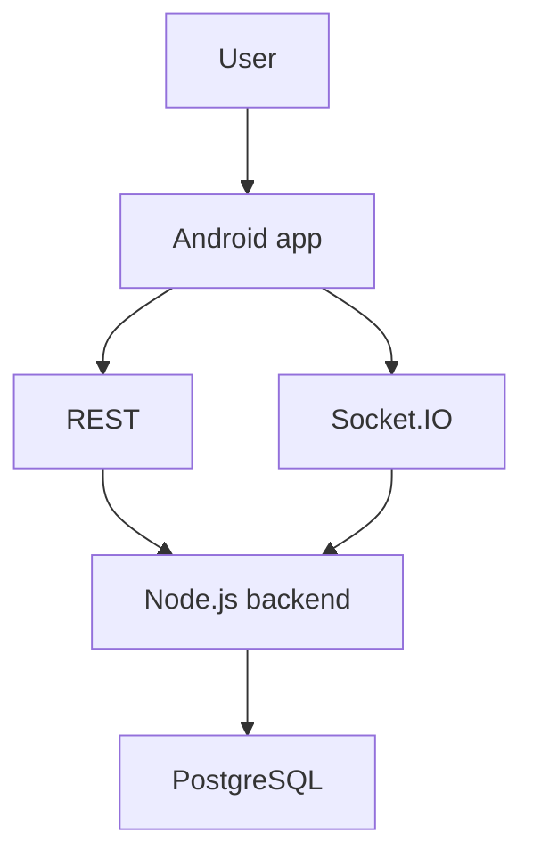

# System architecture

The Android app owns local audio. The backend owns room membership, shared draft metadata, and the spin lifecycle. PostgreSQL is the source of truth. Socket.IO only broadcasts events; it never carries audio bytes.
