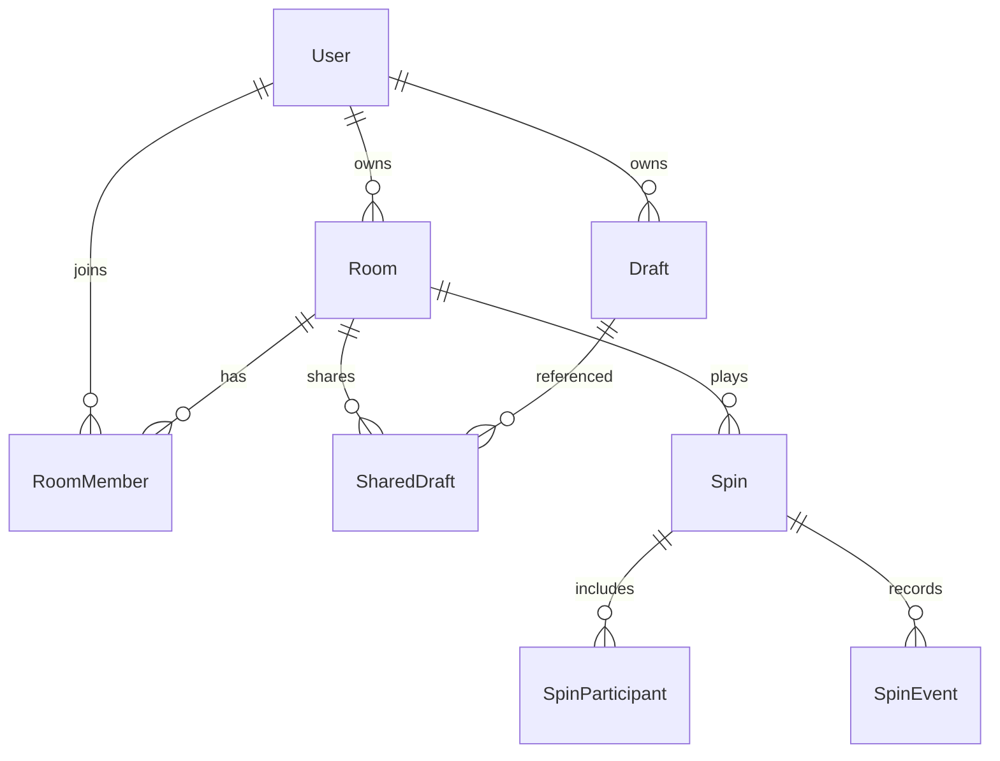

# Database model

```mermaid
erDiagram
  User ||--o{ Draft : owns
  User ||--o{ RoomMember : joins
  User ||--o{ Room : owns
  Room ||--o{ RoomMember : has
  Room ||--o{ SharedDraft : shares
  Room ||--o{ Spin : plays
  Draft ||--o{ SharedDraft : referenced
  Spin ||--o{ SpinParticipant : includes
  Spin ||--o{ SpinEvent : records
```

Schema and migrations live in `backend/prisma/`. Membership rows are kept after leave (`LEFT`); they are not deleted.
