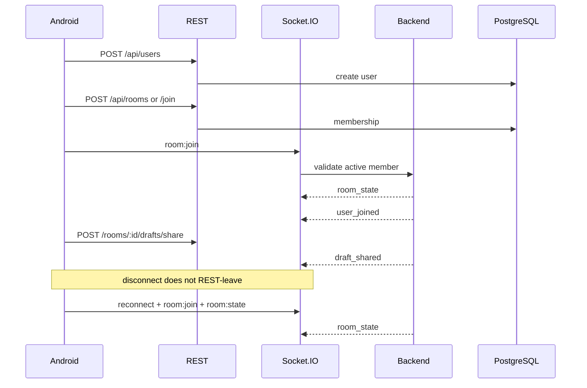

# Room and event flow

```mermaid
sequenceDiagram
  participant A as Android
  participant R as REST
  participant S as Socket.IO
  participant B as Backend
  participant DB as PostgreSQL

  A->>R: POST /api/users
  R->>DB: create user
  A->>R: POST /api/rooms or /join
  R->>DB: membership
  A->>S: room:join
  S->>B: validate active member
  B-->>S: room_state
  B-->>S: user_joined
  A->>R: POST /rooms/:id/drafts/share
  B-->>S: draft_shared
  Note over A,S: disconnect does not REST-leave
  A->>S: reconnect + room:join + room:state
  B-->>S: room_state
```

Mandatory events: `user_joined`, `user_left`, `draft_shared`, `spin_started`, `user_eliminated`, `winner_announced`, `room_state`.
