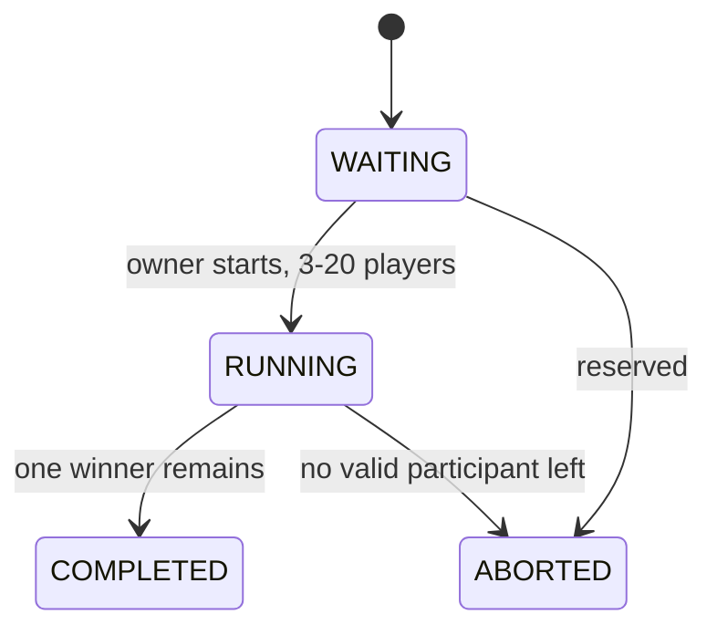

# Spin state machine

Rules enforced only on the backend:

- 3 to 20 active members
- room owner starts the spin
- one active spin per room
- one elimination every 5 seconds
- last remaining eligible user is the winner
- events persist before broadcast: `SPIN_STARTED` → `USER_ELIMINATED`* → `WINNER_ANNOUNCED`

Android displays these events. It does not run a second timer.
